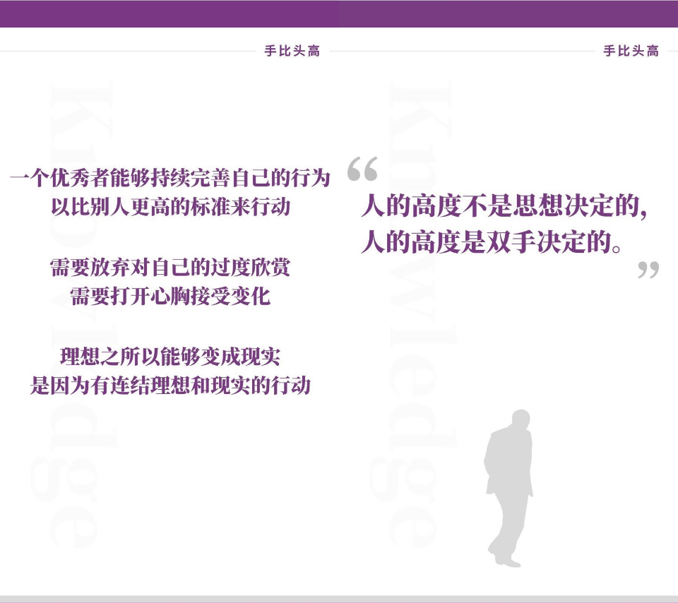

#《激活自我：让知识为自我赋能》 #
## Live 简介 ##
陈春花，北京大学国家发展研究院教授，华南理工大学工商管理学院教授， BiMBA 院长。 2016 《财富》「中国 25 位最具影响力商界女性领袖」 TOP5 ； 2016 《清华管理评论》「管理创新思想家」； 2015 《财富》「中国 25 位最具影响力商界女性领袖」 TOP2 ； 2015 《福布斯》「中国商界女性 50 强」 TOP10 ，曾任新希望六和股份有限公司联席董事长兼首席执行官。先后出版专著 30 余部，最新著作《激活组织》、《激活个体》。

陈教授作为一位集教授、总裁、作家为一体的传奇女学者，分享自己从知识到知识系统到实现效用的实操经验。陈春花教授在知乎的专栏是「春暖花开」，欢迎大家关注。

资源时代、资本时代已经过去，知识时代正全面到来，面对知识浪潮，面对诸多内容平台上提供的纷繁的内容付费产品，该如何选择。

一个「信息爆炸」的时代，你如何甄别「知识」？一个「知识时代」到来，你如何做好准备？

为什么你学了那么多的东西，生活和工作依然没有什么变化？为什么他能学以致用，你却很难形成自己的知识系统？选择之后却带来的是更大的焦虑。

德鲁克说：「未来社会最大的改变一定会发生在知识领域。」在这场知识浪潮之中，我们在改变自己的学习形态的同时，另一方面应该如何节约自己的参与成本，提高自己的学习效率，为自己赋能。

通过这场 Live ，大家将深入了解到知识的本质，以及应该如何选择知识打造自己的知识新结构，如何利用好自己的选择给自己不断赋能，避免随之而来的循环焦虑。

课程地址：[https://www.zhihu.com/lives/879066697724735488](https://www.zhihu.com/lives/879066697724735488)

本次 Live 还邀请到知识专家方军老师和出版人袁璐老师作为提问嘉宾和大家交流，欢迎大家积极提问。

本次 Live 主要包括以下内容

『1.你认识 「知识」吗？』

- 知识的定义
- 知识集合定义

『2.你拥有「知识」吗？』

- 数据、信息、知识
- 知识流动链
- 数据、信息、知识和智慧的关系
- 如何真正拥有「知识」

『3.你的组织拥有「知识」吗？』

- 知识产生效用的四个阶段
- 知识运用于工作产生的结果
- 知识是今天唯一有意义的资源
- 成为一个「知识」驱动的组织
- 知识生产力

『4.让知识有效用：手比头高』

- 如何使知识更具生产力
- 融会贯通
- 终生学习
- 突破自我极限
- 经理人角色的改变
- 知识社会经不起知识潜力的浪费

## PPT ##

